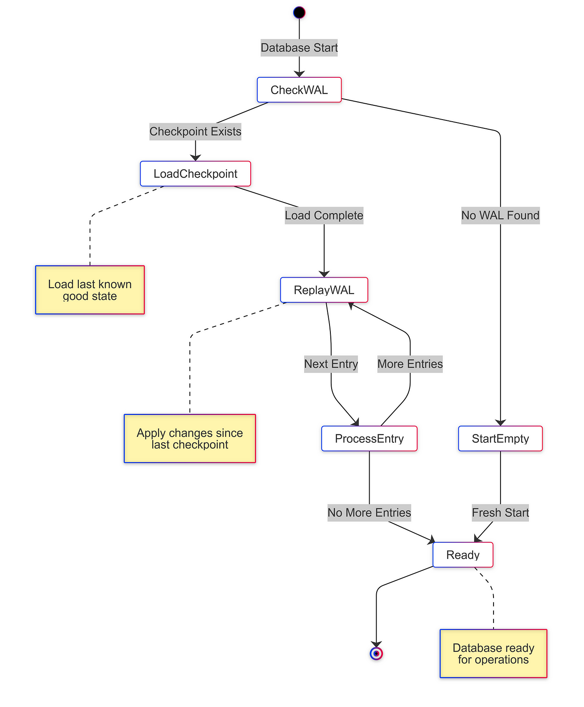

# LSMTree 的学习代码

> [How to Build a Database From Scratch: Understanding LSM Trees and Storage Engines](https://hackernoon.com/how-to-build-a-database-from-scratch-understanding-lsm-trees-and-storage-engines-part-1)

### 架构图

### Checkpoint 过程

### WAL

### 数据库中的 LSM 树（Log-Structured Merge-Tree）详解

#### 1. **为什么需要 LSM 树？**
   - **传统数据库的痛点**：在传统数据库（如 B+ 树）中，数据直接写入磁盘时，频繁的随机写操作（尤其是更新和删除）会导致磁盘寻道时间增加，性能大幅下降。想象一下，你每次往书本里插入一行字，都要翻来覆去找位置，效率极低。
   - **LSM 的灵感**：既然随机写慢，不如把写操作全部变成**顺序追加**（就像写日志一样），利用磁盘顺序写的高吞吐特性。LSM 树由此诞生，专为**高写入场景**优化，例如日志系统、物联网设备数据采集等。

---

#### 2. **LSM 树的核心设计思想**
   LSM 树的核心是“**先内存后磁盘，分层合并**”，具体分为三个关键部分：

   - **内存层（MemTable）**：
     - 数据首先写入内存中的有序结构（如跳表、红黑树），保证高效插入和查询。
     - 一旦内存写满，会冻结为**不可变的 Immutable MemTable**，并开始向磁盘写入。

   - **磁盘层（SSTable）**：
     - 磁盘数据以**多个有序文件（SSTable）**的形式存储，每个文件内部按键排序，但文件之间可能有重叠范围。
     - SSTable 一旦写入就不可变（Immutable），后续通过合并（Compaction）优化。

   - **预写日志（WAL）**：
     - 为防止内存数据丢失，每次写入会先追加到 WAL（类似“操作日志”），故障恢复时重放日志。

---

#### 3. **写入流程：像写日志一样简单**
   1. **写入 WAL**：数据首先追加到 WAL，确保持久性。
   2. **插入 MemTable**：数据进入内存的有序结构。
   3. **内存刷盘**：当 MemTable 达到阈值，冻结并异步刷到磁盘，生成新的 SSTable。
   4. **后台合并**：磁盘上的多个 SSTable 会通过合并操作，合并为更大的有序文件，并清理过期数据。

   **关键优势**：整个过程几乎全是**顺序 I/O**（只有合并时少量随机读），极大提升写入吞吐量！

---

#### 4. **读取流程：可能需要“多方打听”**
   1. **查内存**：先查当前 MemTable，再查冻结的 Immutable MemTable。
   2. **查磁盘**：按时间顺序从新到旧遍历 SSTable 文件，直到找到目标键。
   3. **优化手段**：
     - **布隆过滤器（Bloom Filter）**：快速判断某个键是否在 SSTable 中，减少无效查询。
     - **层级索引**：高层级（如 L1）的 SSTable 范围不重叠，低层级逐步合并减少重叠。

   **缺点**：读性能可能不如 B+ 树，尤其是在数据分散在多个 SSTable 时。

---

#### 5. **合并（Compaction）：LSM 的“家务整理”**
   - **合并的作用**：
     - 消除重复数据（如多次更新的值）。
     - 删除标记为删除的条目（墓碑标记）。
     - 减少 SSTable 文件数量，提升查询效率。

   - **合并策略**：
     - **Size-Tiered Compaction**：将大小相近的 SSTable 合并成更大的文件（如 Cassandra）。简单但空间放大明显。
     - **Leveled Compaction**（分层的 LSM）：数据按层级组织，每层文件大小固定且范围不重叠（如 LevelDB）。读性能更好，但写放大更高。

   **示例**：假设 Level 1 有 10 个小文件，合并到 Level 2 时会变成一个覆盖相同范围的大文件，并清理旧数据。

---

#### 6. **LSM 树的优缺点**
   - **优点**：
     - **写入吞吐极高**：顺序追加 + 批量刷盘。
     - **天然支持高吞吐场景**：日志、监控数据、消息队列（如 Kafka 底层存储）。
     - **自动压缩**：减少碎片化，适合 SSD 寿命优化。

   - **缺点**：
     - **读延迟不稳定**：可能需要查询多层结构。
     - **写放大（Write Amplification）**：合并过程可能多次重写数据。
     - **空间放大（Space Amplification）**：未合并前存在多版本数据。

---

#### 7. **LSM 树的应用场景**
   - **NoSQL 数据库**：Cassandra、HBase、RocksDB（LevelDB 的增强版）。
   - **时序数据库**：InfluxDB、TimescaleDB（高频率写入）。
   - **分布式存储**：Google BigTable、Amazon DynamoDB 的底层存储逻辑。
   - **消息队列**：Kafka 的消息持久化（顺序写 + 分段合并）。

---

#### 8. **LSM vs B+ 树：如何选择？**
   - **选 LSM**：需要高写入吞吐、容忍稍高的读延迟（如日志采集）。
   - **选 B+ 树**：需要低延迟读、事务支持（如 OLTP 数据库）。

---

#### 总结
LSM 树通过“**牺牲部分读性能，换取极致写吞吐**”，成为大数据时代的核心存储结构。它的设计哲学是：**延迟处理复杂问题**（如合并和删除），用后台任务换取前台的写入速度。理解 LSM，就理解了 LevelDB、RocksDB 甚至分布式数据库的底层奥秘！

**附一个生活化比喻**：  
LSM 树就像一个高效的“快递分拣中心”——包裹（数据）先被快速扔进临时货架（内存），货架满了就打包成箱子（SSTable）堆到仓库。仓库定期整理箱子（合并），把相同区域的包裹合并到大箱子里，方便后续查找。
